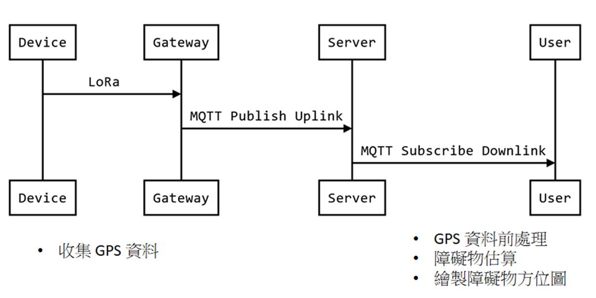

# GPS_Shelter
## Module 
* This Module is to using the raspberry-pi 3rd with GPS module to receive the GPS data to find the shelter.
## System Architecture
* Following is the system architecture
    * 
    * The end nodes (like raspberry-pi) usually has lower computing ability than server, so end node could collect the GPS datas and then transmit them to the server through LORA wireless protocol.

## How to run it
* mqtt_request.py : this code is to request the datas that end-devices transmitted
    * input : 
        * file name : the datas end-devices transmitted
        * server account
        * server password